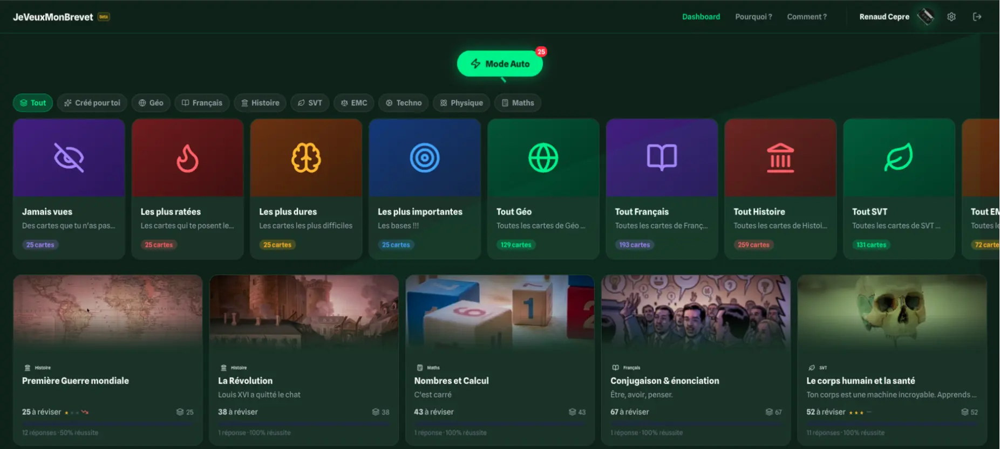

# jeveuxmonbrevet

> Flashcard app for French middle school students preparing for the Brevet exam.

## Overview

I built this for my daughter who's about to take the Brevet
— the French end-of-middle-school exam.
It was supposed to be a small thing. But I tend to get carried away
when I'm having fun building something — so it turned into a real
deployed app with actual users. I even caught myself using it
regularly because it's honestly a decent way to brush up on
general knowledge.

Spaced repetition learning tool covering all Brevet subjects — History, Geography,
Math, French, Sciences, Civic Education. Built around a "Chill UI / Savage Copy"
philosophy: minimal zen interface, witty copy that speaks to teenagers without
being condescending.

## Features

- **Spaced repetition** — SM-2 algorithm, Anki-style 4-button rating
- **Auto Mode** — dynamic card budget that adjusts to learning pace
- **Gamification** — streaks, XP, mastery levels, confetti on Easy ratings
- **Keyboard-first** — spacebar to flip, 1–4 to rate
- **PWA** — offline-capable, installable on mobile
- **Google OAuth** — progress synced to backend per user

## Stack

- Nuxt 4 · Vue 3 · TypeScript
- Supabase (PostgreSQL + Google OAuth)
- Nuxt Content (static JSON flashcard files)
- KaTeX (math rendering)
- Netlify

## Status

Live at [jeveuxmonbrevet.com](https://jeveuxmonbrevet.com) — v0.1.21, actively developed.
